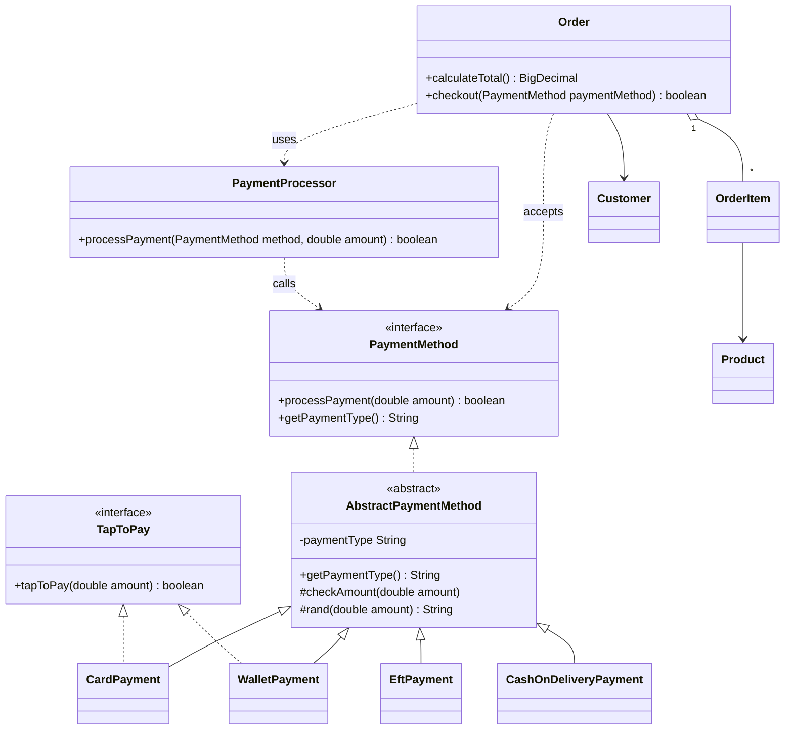

# PayNest class diagram (Capstone 3)

```mermaid
classDiagram
    class PaymentMethod {
        <<interface>>
        +processPayment(double amount) boolean
        +getPaymentType() String
    }
    class TapToPay {
        <<interface>>
        +tapToPay(double amount) boolean
    }
    class AbstractPaymentMethod {
        <<abstract>>
        -paymentType String
        +getPaymentType() String
        #checkAmount(double amount)
        #rand(double amount) String
    }
    class CardPayment
    class EftPayment
    class WalletPayment
    class CashOnDeliveryPayment
    class PaymentProcessor {
        +processPayment(PaymentMethod method, double amount) boolean
    }
    class Order {
        +calculateTotal() BigDecimal
        +checkout(PaymentMethod paymentMethod) boolean
    }
    class OrderItem
    class Product
    class Customer

    PaymentMethod <|.. AbstractPaymentMethod
    AbstractPaymentMethod <|-- CardPayment
    AbstractPaymentMethod <|-- EftPayment
    AbstractPaymentMethod <|-- WalletPayment
    AbstractPaymentMethod <|-- CashOnDeliveryPayment
    TapToPay <|.. CardPayment
    TapToPay <|.. WalletPayment
    Order ..> PaymentMethod : accepts
    Order ..> PaymentProcessor : uses
    PaymentProcessor ..> PaymentMethod : calls
    Order "1" o-- "*" OrderItem
    OrderItem --> Product
    Order --> Customer
```